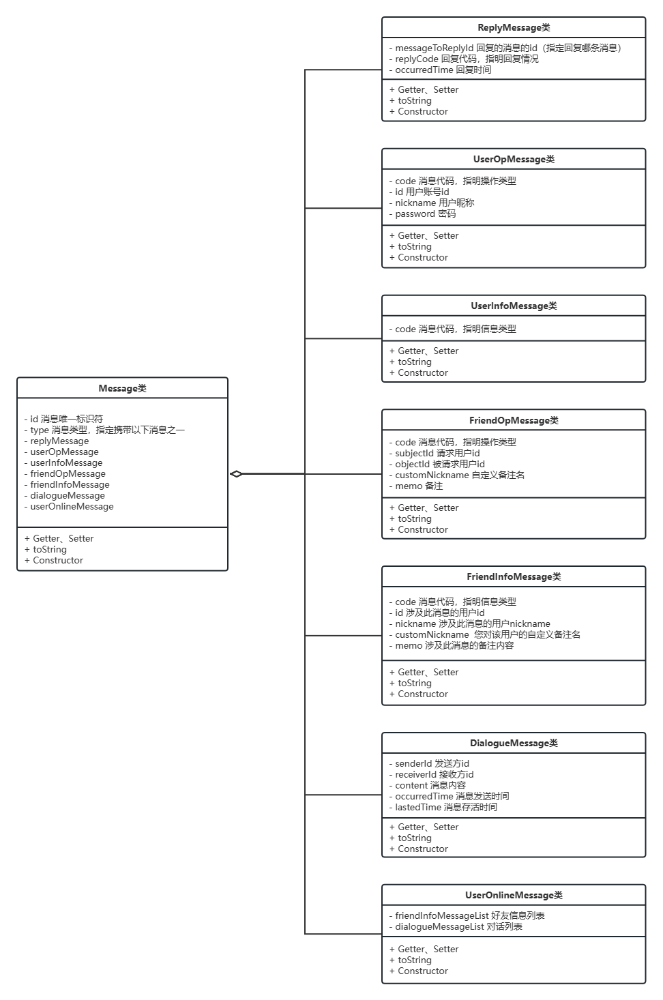

# Adonis项目文档

[toc]

## 1 系统需求

### 1.1 问题域描述

 民法典第一千零三十二条规定，自然人享有隐私权，任何人不得以刺探、侵扰、泄露、公开等方式侵害他人的隐私权。

  人与人之间的私密聊天是普遍存在的需求。在互联网时代，使用聊天软件进行沟通已经成为主流社交手段，然而聊天信息的安全性很难得到保证。相较于普通聊天，人们希望表达私人想法或秘密等涉及个人隐私的聊天内容得到更好的保护，以防止任何可能的泄露。市面上存在类似的产品，如钉钉密聊。

Adonis专门为私密聊天设计，可以对抗黑客攻击或人为泄露。它是一款简洁易用的聊天软件，以安全、私密为特色。它用于单聊，支持端到端加密通信、自定义密钥，可设置消息自动销毁时间，可禁止截屏以对抗保存手段。

Adonis前后端分离，前端包括安卓端、网页端，后端采用微服务架构。

### 1.2 系统功能清单

#### 1.2.1 用例图


#### 1.2.2 详细功能列表

| 类别 | 功能         | 详细说明                                                     |
| ---- | ------------ | ------------------------------------------------------------ |
| 用户 | 注册         | 注册新用户。用户ID为用户账号的唯一标识符，由用户自己设置，不由系统分配。 |
| 用户 | 登录         | 登录账号。                                                   |
| 用户 | 修改昵称     | 已登录用户修改昵称。                                         |
| 用户 | 修改密码     | 已登录用户修改密码。                                         |
| 用户 | 登出         | 退出账号。                                                   |
| 用户 | 注销         | 注销用户。                                                   |
| 好友 | 添加好友     | 发送添加好友申请，可选择是否附带备注消息。                   |
| 好友 | 同意好友     | 同意好友申请。                                               |
| 好友 | 拒绝好友     | 拒绝好友申请。                                               |
| 好友 | 显示状态     | 显示好友在线状态。                                           |
| 好友 | 删除好友     | 单方面删除好友，自己仍在对方的好友列表中，但对方无法给自己发消息了。 |
| 好友 | 查询好友     | 根据ID查询可添加好友。                                       |
| 好友 | 拉黑好友     | 被拉黑者无法给拉黑方发送消息，也无法发送好友申请。           |
| 好友 | 好友备注     | 添加或修改对好友的备注名。                                   |
| 对话 | 发送消息     | 给好友发送消息。                                             |
| 对话 | 显示消息时间 | 显示所有消息的发送时间。以消息到达服务器中转的时间为准。     |
| 对话 | 设置倒计时T  | 对每个好友单独设置。设置后向该好友发出去的消息过期时间均为T（即对方查看消息后，经过时间T消息自动销毁）。若未设置则默认T=0，消息不过期。T**小于等于**1天。 |
| 对话 | 消息加密     | 对每个好友单独设置密钥。聊天双方需设置同一个密钥，之后双方发送的消息均使用该密钥由**对称加密算法**进行加密解密。若未设置则直接传输明文。 |
| 对话 | 禁止截屏     | 禁止用户截屏。                                               |

对用户的约束如下：

ID：由2\~20个汉字/英文字母/数字组成。

昵称：由0\~20个汉字/英文字母/数字组成。

密码：由6\~20个汉字/英文字母/数字组成。

备注昵称：由0\~20个汉字/英文字母/数字组成。

单条消息：500个任意字符以内。

加密算法约定：

可以使用任意语言的短语作为密钥（如“五月五日”），如超出长度被自动截断。双方可以在线下或其它聊天工具约定密钥。

AES加密算法，使用Base64编码、ECB模式、PKCS7-PKCS5填充算法、256位密钥、0bytes偏移量。

参考：[AES在线加密解密工具 - MKLab在线工具](https://www.mklab.cn/utils/aes)

#### 1.2.3 安卓端运行截图

略。

#### 1.2.4 网页端运行截图

略。

### 1.3 领域模型

核心数据类：


整个系统的层次和结构见**2.1 系统总体架构**。

### 1.4 使用核心用例展示系统动态特性


## 2 系统设计

### 2.1 系统总体架构

#### 2.1.1 服务端

服务端采用微服务分层架构，包图：


服务端类图：


整个系统使用统一的通信协议类进行通信，通信协议类图：



#### 2.1.2 安卓端

略。

#### 2.1.3 网页端

略。

### 2.2 通信协议

所有消息均为`Message`类的对象，使用[alibaba/fastjson2](https://github.com/alibaba/fastjson2)序列化为字符串发送。

只需要填充所需字段，其它字段设为`null`。

#### 2.2.1 消息结构

**消息类**

消息类位于`Adonis_Server/AdonisWebsocket/src/main/java/com/reddish/adoniswebsocket/Utils/Message`。

全部消息均为**Message**类的对象，其**包含且仅包含一个**具体消息类的对象。Message类的对象将id作为唯一标识符，其用UUID生成。

一共7个具体消息类：

1. **ReplyMessage**用于服务端向客户端一一回复**所有**客户端向服务端发送过的任何消息（除了ReplyMessage）的查收情况，携带要回复的消息的id和回复代码。回复代码为0表示成功执行，其他代码均为**异常代码**。客户端也要向服务端发这个。

2. **UserOpMessage**用于客户端向服务端发送用户操作消息。

3. **UserInfoMessage**用于服务端向客户端发送用户信息消息，用来回应用户操作消息。

4. **FriendOpMessage**用于客户端向服务端发送好友操作消息。

5. **FriendInfoMessage**用于客户端向服务端发送好友信息消息，用来回应与相关好友操作相关的所有用户。

6. **DialogueInfoMessage**用于客户端向服务端发送和接收对话消息。

7. **UserOnlineMessage**用于服务端在客户端登录上线时，给其发送**离线期间**的消息，包括FriendInfoMessage和DialogueInfoMessage。用户**请求后**再发送。

消息代码位于`MessageCode.java`。

消息代码由具体消息对象携带，用枚举类的枚举对象表示，含有一个数字用作标识符，一个字符串用作解释性说明

**异常类**

异常类位于`Adonis_Server/AdonisWebsocket/src/main/java/com/reddish/adoniswebsocket/Utils/Exception`。

异常代码位于`ExceptionCode.java`。

异常代码由ReplyMessage对象携带，异常表示开发过程中可能出现的错误，以及应由客户端预防而不应在服务端出现的错误，实际中并无用途。

#### 2.2.2 详细说明

**UserOpMessage和UserInfoMessage说明**

客户端向服务端发送UserOpMessage，服务端向客户端发送UserInfoMessage。

其中消息代码所有可能的情况如下：

UIF_OP_SUCCESS用来回复**所有**已成功处理的UserOpMessage。下面是其它情况。

发送UOP_SIGN_IN请求登录，可能收到UIF_NOT_EXIST、UIF_WORRY_PASSWORD。

发送UOP_SIGN_UP请求注册，可能收到UIF_ALREADY_EXIST、UIF_INCOMPLETE_INFO。

下面情况均需要操作放在线，不在线会发送UIF_OFFLINE。

发送UOP_SIGN_OUT下线。

发送UOP_DELETE请求注销。

发送UOP_CHANGE_NICKNAME修改昵称，可能收到UIF_NO_NICKNAME。

发送UOP_CHANGE_PASSWORD修改密码，可能收到UIF_NO_PASSWORD。

发送UOP_REQUEST_ONLINE_MESSAGE请求在线消息（同步自己不在线时的消息），必然收到UIF_REPLY_ONLINE_MESSAGE，然后服务端会发送UserOnlineMessage给请求方。

**FriendOpMessage和FriendInfoMessage说明**

客户端向服务端发送FriendOpMessage，服务端向客户端发送FriendInfoMessage（不仅向操作发送方发送，也可能向操作涉及方发送）。

> 以下称FriendOpMessage中subjectId对应的用户为s，objectId对应的用户为o。

FriendInfoMessage用于告知好友操作相关方（s、o）额外信息。

其中消息代码所有可能的情况如下：

FIF_OP_SUCCESS用来回复**所有**已成功处理的FriendOpMessage。下面是其它情况。

s发送FOP_ADD请求添加o为好友，s可能收到FIF_BLOCK、FIF_ADD_CONSENT，o可能收到FIF_ADD_YOU。

s发送FOP_CONSENT同意添加o为好友，o可能收到FIF_ADD_CONSENT。

s发送FOP_REJECT拒绝添加o为好友，o可能收到FIF_REJECT。

s发送FOP_DELETE删除好友o。

s发送FOP_QUERY_EXIST查询好友o是否存在，s可能收到FIF_EXIST、FIF_NOT_EXIST。

s发送FOP_QUERY_ONLINE查询好友o是否在线，s可能收到FIF_ONLINE、FIF_OFFLINE。

s发送FOP_BLOCK拉黑好友o。

s发送FOP_CUSTOM_NICKNAME修改对好友o的备注昵称。

s发送FOP_QUERY_FRIENDSHIP查询自己与o的好友关系，可能收到FIF_TWO_WAY、FIF_SINGLE_FOR_YOU、FIF_SINGLE_ON_YOU、FIF_FREE。

**DialogueMessage说明**

其中**lastedTime**字段表示消息存活时间T，由客户端填写。当消息查收方查看该消息后经过时间T，该消息会自动销毁。若T=0，表示该消息存活时间为无限。用长整型表示，单位为毫秒，意思是T的大小。

客户端不需要填写**occurredTime**字段，服务端会填写，以服务端中转时间表示消息发送时间。用长整型表示，单位为毫秒，意义是自1970年1月1日 00:00:00 GMT到消息发送时刻经过的毫秒数，

**UserOnlineMessage说明**

dialogueMessageList列表内含用户离线期间收到的所有DialogueMessage，按时间先后排序（以occurredTime作为排序字段）。

friendInfoMessageList列表内含好友相关的所有FriendInfoMessage。

这里的FriendInfoMessage会有的消息代码如下：

FIF_ADD_YOU 此用户正申请将您加入好友列表

FIF_ADD_TO 您正申请将此用户加入好友列表

FIF_TWO_WAY 此用户和您是双向好友

FIF_SINGLE_ON_YOU 此用户是您的单向好友（您列表没它，它列表有您）

FIF_SINGLE_FOR_YOU 此用户是您的单向好友（您列表没它，它列表有您）

FIF_BLOCK 此用户已将您拉黑

FIF_REJECT 此用户拒绝您的好友申请

FIF_NOT_EXIST 此用户已经注销，不存在了

**ReplyMessage说明**

只要收到消息，就会发送异常代码为0的此消息表示收到。

ReplyMessage包含的其它异常代码应只用于开发调试。

### 2.3 技术关键点及解决方案

#### 2.3.1 消息类设计

不把这多个Message类继承一个父类，而是组合起来，是因为继承还得判断一次要序列化为哪个子类。

Message类的id用UUID生成以确保唯一性，作用有二：

1. 让ReplyMessage标记回复的是哪条消息。

2. 同一条消息可能被重复发送（TCP的超时重传机制），去重。

略。

### 2.4 组件图


### 2.5 部署图

 

## 3 系统附加说明

### 3.1 编译与开发环境

#### 3.1.1 开发工具

| 模块       | 框架            | IDE / 工具             |
| ---------- | --------------- | ---------------------- |
| app开发    | Jepack / kotlin | Android Studio         |
| web开发    | Vue3            | vscode                 |
| 服务端开发 | Spring          | IntelliJ IDEA Ultimate |
| 数据库开发 | MySQL           |                        |
| 测试       |                 | apipost                |

#### 3.1.2 服务端运行环境

阿里云ECS

**镜像ID**

ubuntu_22_04_x64_20G_alibase_20221228.vhd

**java版本**

openjdk 19.0.2 2023-01-17

OpenJDK Runtime Environment (build 19.0.2+7-Ubuntu-0ubuntu322.04)

OpenJDK 64-Bit Server VM (build 19.0.2+7-Ubuntu-0ubuntu322.04, mixed mode, sharing)

**mysql版本**

mysql  Ver 8.0.32-0ubuntu0.22.04.2 for Linux on x86_64 ((Ubuntu))

#### 3.1.3 安卓端运行环境

**Kotlin版本**

org.jetbrains.kotlin.android   version 1.8.0

**Android版本**

com.android.application version '7.4.2'

com.android.library version '7.4.2'

#### 3.1.4 Vue端运行环境

**node版本**

v18.14.0

**npm版本**

9.3.1

**gulp-cli版本**

2.3.0

### 3.2 安装与卸载方法

#### 3.2.1 服务端

保证9000、8080、8001端口不被占用，然后启动EurekaServer-0.0.1-SNAPSHOT.jar、AdonisWebsocket-0.0.1-SNAPSHOT.jar、AdonisBase-0.0.1-SNAPSHOT.jar。启动脚本见源代码文件夹Adonis_Server目录下的startAll.sh脚本。

#### 3.2.2 安卓端

 用户正常安装卸载安卓app即可。

#### 3.2.3 Vue端

首先在node官网下载安装包安装node。

之后使用命令安装npm工具，命令如下。

```bash
npm install -g cnpm --registry=https://registry.npm.taobao.org
```

再使用命令安装vue-cli脚手架，命令如下。

```bash
cnpm install --global vue-cli
```

之后进入项目文件夹运行即可，命令如下。

```bash
npm run serve
```

